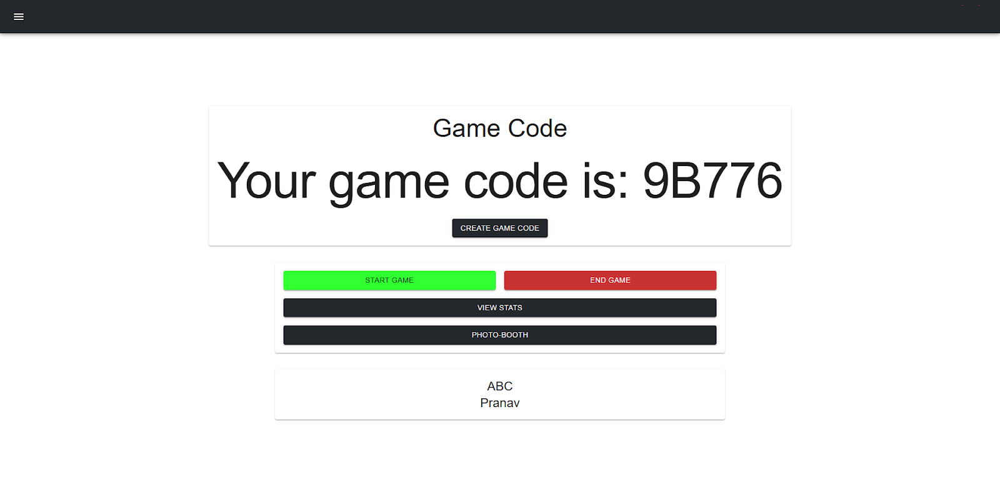
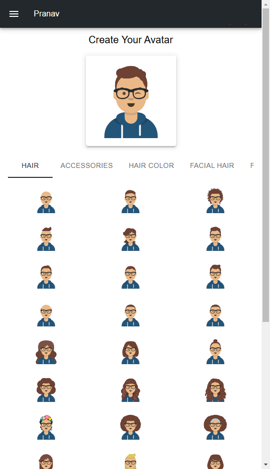
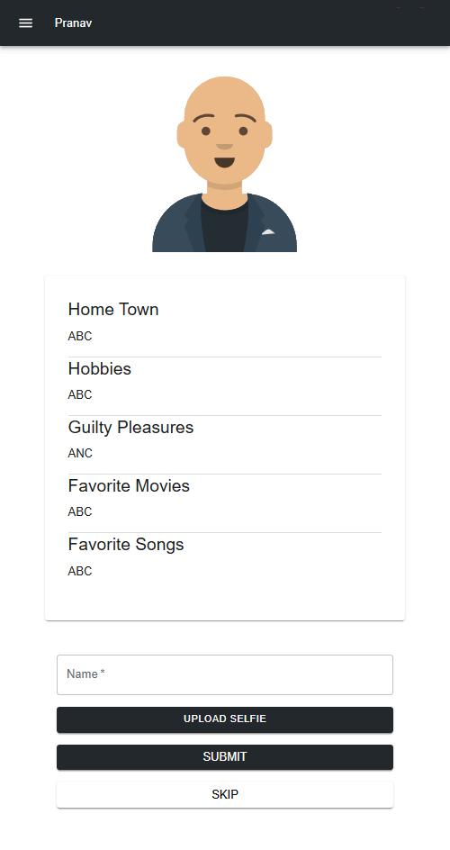
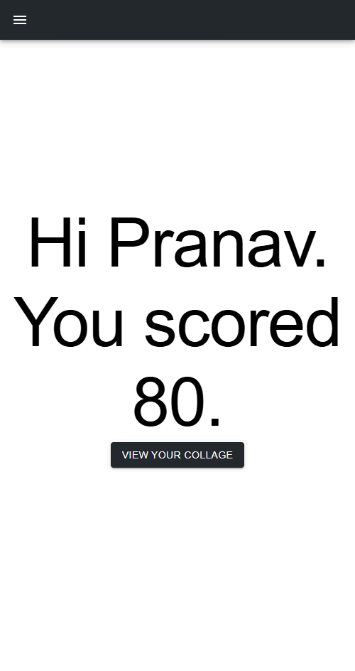

# Ice Breaker

## Overview
**Ice Breaker** is a physical activity-based game where players join a virtual room to find participants based on shared interests and hobbies. Each player is assigned a random participant to locate, take a selfie with, and move on to the next until the game ends. The player who finds the most participants wins!

This project was developed using **Node.js** and **Express** for the backend and **React** for the frontend.

## Features
- Participants can join a game by entering their details (hobbies, interests, etc.)
- Each participant is assigned another random participant to find based on hobbies and interests
- Participants can upload selfies to confirm they found the assigned person
- The game automatically tracks and scores each participant’s progress
- Chatbot available at the end to answer frequently asked questions

## Technologies Used
- **Backend**: Node.js, Express, SQLite (for storing participants and game data)
- **Frontend**: React, Material-UI

## Installation
1. **Clone the repository**
    ```bash
    git clone https://github.com/pranav-suri/ice-breaker.git
    cd ice-breaker
    ```

2. **Env Variables**
Create a `.env` file in the `server` directory with the  variables defined in .env.example:

3. **Setup**
    - Please ensure you've completed the above step.
    - Install dependencies:
      ```bash
      npm install
      or
      bun install
      ```
    - Start the applications:
      ```bash
      npm run dev
      or 
      bun run dev
      ```
      We've combined the both the scripts together so both the server and client can be started with this one command.

## Playing the game
1. **Add yourself as an admin**
2. **A game code will be displayed onscreen once you're an admin**


3. **Let other players enter the code**
4. **Players will create their avatar and enter some information about themselves**


4. **Start the game**
5. **All players will be randomly assigned another player**


6. **Find the player in the room and click a photo with them**
7. **The admin can end the game from his panel**
8. **Once the game ends, all players can view their photos and gallery can also be displayed on admin page**




Participants can join the game, find others, and upload selfies, all through the web interface.


